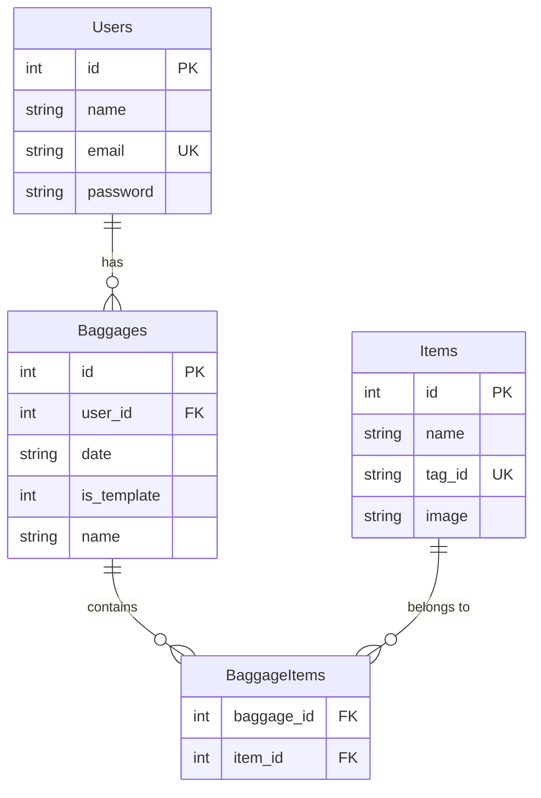

# 設計書

## 概要

もってくんは、ドメイン駆動設計（DDD）アーキテクチャを採用し、生の PHP と SQLite を使用して実装されます。システムは持ち物管理、RFID タグスキャン、天気情報連携の 3 つの主要ドメインで構成され、ユーザーの日常的な忘れ物防止をサポートします。

## アーキテクチャ

### レイヤー構成

```
┌─────────────────────────────────────┐
│           Presentation Layer        │
│  (Controllers, Views, Web Interface)│
├─────────────────────────────────────┤
│          Application Layer          │
│        (Use Cases, Services)        │
├─────────────────────────────────────┤
│           Domain Layer              │
│   (Entities, Value Objects, Rules)  │
├─────────────────────────────────────┤
│        Infrastructure Layer         │
│  (Repositories, External Services)  │
└─────────────────────────────────────┘
```

### ドメインモデル

システムは以下の 3 つの境界コンテキストで構成されます：

1. **ユーザー管理コンテキスト**: ユーザー認証と管理
2. **持ち物管理コンテキスト**: 持ち物セット、アイテム、テンプレートの管理
3. **外部サービスコンテキスト**: RFID、天気 API 連携

## コンポーネントとインターフェース

### ドメインエンティティ

#### User（ユーザー）

-   プロパティ: id, name, email, password
-   責務: ユーザー認証情報の管理

#### Baggage（持ち物セット）

-   プロパティ: id, user_id, date, is_template, name
-   責務: 持ち物セットの管理、テンプレート機能

#### Item（アイテム）

-   プロパティ: id, name, tag_id, image
-   責務: 個別アイテムの管理、RFID タグ関連付け

#### BaggageItem（持ち物アイテム関連）

-   プロパティ: baggage_id, item_id
-   責務: 持ち物セットとアイテムの多対多関係管理

### 値オブジェクト

#### TagId

-   RFID タグ ID の値オブジェクト
-   バリデーション: 一意性、形式チェック

#### ItemName

-   アイテム名の値オブジェクト
-   バリデーション: 長さ制限、文字種制限

### リポジトリインターフェース

#### UserRepository

-   findById(int $id): ?User
-   findByEmail(string $email): ?User
-   save(User $user): void

#### BaggageRepository

-   findByUserAndDate(int $userId, string $date): array
-   findTemplatesByUser(int $userId): array
-   save(Baggage $baggage): void

#### ItemRepository

-   findByUser(int $userId): array
-   findByTagId(string $tagId): ?Item
-   save(Item $item): void

### アプリケーションサービス

#### TopUsecase

-   getTodaysBaggage(int $userId): array
-   getWeatherSuggestion(string $location): ?string

#### BaggageRegisterUsecase

-   registerBaggage(int $userId, string $date, array $itemIds): void
-   createTemplate(int $userId, string $name, array $itemIds): void
-   applyTemplate(int $userId, int $templateId, string $date): void

#### ItemRegisterUsecase

-   registerItem(int $userId, string $name, ?string $image): Item
-   assignTagToItem(int $itemId, string $tagId): void

#### UserRegisterUsecase

-   registerUser(string $name, string $email, string $password): User
-   authenticateUser(string $email, string $password): ?User

## データモデル

### データベーススキーマ

```sql
-- Users テーブル
CREATE TABLE users (
    id INTEGER PRIMARY KEY AUTOINCREMENT,
    name TEXT NOT NULL,
    email TEXT UNIQUE NOT NULL,
    password TEXT NOT NULL
);

-- Baggages テーブル
CREATE TABLE baggages (
    id INTEGER PRIMARY KEY AUTOINCREMENT,
    user_id INTEGER NOT NULL,
    date TEXT,
    is_template INTEGER DEFAULT 0,
    name TEXT,
    FOREIGN KEY (user_id) REFERENCES users(id)
);

-- Items テーブル
CREATE TABLE items (
    id INTEGER PRIMARY KEY AUTOINCREMENT,
    name TEXT NOT NULL,
    tag_id TEXT UNIQUE,
    image TEXT
);

-- Baggage_Items 中間テーブル
CREATE TABLE baggage_items (
    baggage_id INTEGER NOT NULL,
    item_id INTEGER NOT NULL,
    PRIMARY KEY (baggage_id, item_id),
    FOREIGN KEY (baggage_id) REFERENCES baggages(id),
    FOREIGN KEY (item_id) REFERENCES items(id)
);
```

### データ関係図



## 正確性プロパティ

_プロパティとは、システムの全ての有効な実行において真であるべき特性や動作のことです。これは人間が読める仕様と機械で検証可能な正確性保証の橋渡しとなります。_

### プロパティ 1: 今日の持ち物表示の完全性

*任意の*ユーザーと日付の組み合わせに対して、その日付に関連付けられた全てのアイテムが表示され、各アイテムには名前と画像情報が含まれる
**検証対象: 要件 1.1, 1.3**

### プロパティ 2: 天気に基づく提案の一貫性

*任意の*雨の天気データに対して、システムは傘の追加を提案し、ユーザーが提案を受け入れた場合は今日の持ち物に傘が追加される
**検証対象: 要件 1.5, 8.2, 8.4**

### プロパティ 3: ユーザー関連付けの不変性

*任意の*作成操作（持ち物セット、テンプレート、アイテム）において、作成されたエンティティは必ず現在のユーザーに関連付けられる
**検証対象: 要件 2.4, 3.4, 7.2**

### プロパティ 4: 持ち物セット作成の一貫性

*任意の*アイテム選択と日付の組み合わせに対して、直接作成またはテンプレート適用により、選択されたアイテムを含む持ち物セットが正しく作成される
**検証対象: 要件 2.3, 4.4**

### プロパティ 5: テンプレート保存の正確性

*任意の*テンプレート作成において、テンプレートは日付情報なしで保存され、選択されたアイテムが正しく関連付けられる
**検証対象: 要件 3.2, 3.3**

### プロパティ 6: RFID タグ識別の正確性

*任意の*RFID タグスキャンに対して、システムは正しいアイテムを識別し、スキャン結果にはアイテム詳細が含まれる
**検証対象: 要件 5.2, 5.3**

### プロパティ 7: 持ち物比較の正確性

*任意の*スキャン結果と今日の持ち物の比較において、不足しているアイテムが正しく特定され、ハイライト表示される
**検証対象: 要件 5.4**

### プロパティ 8: タグ一意性制約

*任意の*タグ ID 割り当てにおいて、既に使用されているタグ ID は拒否され、新しいタグ ID のみが受け入れられる
**検証対象: 要件 6.3**

### プロパティ 9: タグ割り当ての永続性

*任意の*タグ割り当て操作において、アイテムレコードは提供されたタグ ID で正しく更新され、以降の検索で正しく識別される
**検証対象: 要件 6.4**

### プロパティ 10: アイテム更新時の関連付け保持

*任意の*アイテム更新操作において、既存の持ち物セットとの関連付けは変更されずに保持される
**検証対象: 要件 7.5**

### プロパティ 11: ユーザー固有データの分離

*任意の*ユーザーに対して、そのユーザーのテンプレートやアイテムのみが表示され、他のユーザーのデータは表示されない
**検証対象: 要件 4.1, 6.1**

## エラーハンドリング

### データベースエラー

-   SQLite 接続エラー: 適切なエラーメッセージを表示し、再試行オプションを提供
-   データ整合性エラー: トランザクションロールバックと詳細なエラー情報の提供
-   一意制約違反: ユーザーフレンドリーなメッセージで重複データの存在を通知

### 外部サービスエラー

-   天気 API 接続エラー: 天気提案機能を無効化し、通常機能は継続
-   RFID リーダーエラー: エラー状態を表示し、手動入力オプションを提供

### バリデーションエラー

-   不正な入力データ: フィールドレベルでのバリデーションメッセージ表示
-   必須フィールド未入力: リアルタイムバリデーションによる即座のフィードバック
-   ファイルアップロードエラー: サポートされる形式とサイズ制限の明示

### セッション管理エラー

-   セッション期限切れ: 自動的にログイン画面にリダイレクト
-   認証エラー: セキュアなエラーメッセージで不正アクセスを防止

## テスト戦略

### 二重テストアプローチ

システムは単体テストとプロパティベーステストの両方を使用して包括的なテスト戦略を実装します：

#### 単体テスト

-   特定の例、エッジケース、エラー条件を検証
-   コンポーネント間の統合ポイントをテスト
-   具体的なバグを捕捉するのに効果的

#### プロパティベーステスト

-   全ての入力にわたって成り立つべき普遍的なプロパティを検証
-   一般的な正確性を確認
-   単体テストでは見つからない微妙なバグを発見

両方のテストタイプは相補的であり、包括的なカバレッジを提供します。単体テストは具体的なバグを捕捉し、プロパティテストは一般的な正確性を検証します。

#### プロパティベーステストの実装

-   **使用ライブラリ**: PHPUnit with Eris (Property-Based Testing library for PHP)
-   **最小実行回数**: 各プロパティテストは最低 100 回の反復実行を行う
-   **テストタグ**: 各プロパティベーステストには対応する設計書のプロパティを明示的に参照するコメントを含める
-   **タグ形式**: `**Feature: baggage-management, Property {number}: {property_text}**`
-   **実装要件**: 各正確性プロパティは単一のプロパティベーステストで実装される

#### 単体テストの実装

-   **使用フレームワーク**: PHPUnit
-   **テスト対象**:
    -   エンティティのビジネスロジック
    -   値オブジェクトのバリデーション
    -   リポジトリの基本 CRUD 操作
    -   ユースケースの正常系・異常系
-   **モック使用**: 外部依存（データベース、API）はモックを使用
-   **カバレッジ目標**: コードカバレッジ 80%以上を目標

#### テスト環境

-   **テストデータベース**: インメモリ SQLite を使用
-   **テストデータ**: ファクトリパターンでテストデータ生成
-   **CI/CD**: 全てのテストが自動実行され、失敗時はデプロイを停止

## 実装考慮事項

### セキュリティ

-   パスワードハッシュ化: password_hash()と password_verify()を使用
-   SQL インジェクション対策: PDO プリペアドステートメントの徹底使用
-   XSS 対策: htmlspecialchars()による出力エスケープ
-   CSRF 対策: トークンベースの保護機能実装

### パフォーマンス

-   データベースインデックス: 頻繁に検索されるカラムにインデックス設定
-   画像最適化: アップロード時の自動リサイズと圧縮
-   キャッシュ戦略: 天気データの適切なキャッシュ実装

### 拡張性

-   設定ファイル: 環境固有の設定を外部化
-   ログ機能: エラーと重要な操作のログ記録
-   国際化対応: 多言語対応のための基盤準備

### フロントエンド実装詳細

#### 技術スタック

-   **HTML5**: セマンティックマークアップの使用
-   **Tailwind CSS**: CDN 経由での読み込み（https://cdn.tailwindcss.com）
-   **バニラ JavaScript**: フレームワークなしでのインタラクティブ機能実装

#### レスポンシブデザイン

-   PC ファースト設計

#### ユーザビリティ

-   直感的なナビゲーション
-   明確なフィードバックメッセージ

#### JavaScript 機能

-   フォームバリデーション
-   動的な UI 更新
-   AJAX 通信によるページ遷移なしでのデータ更新
-   RFID スキャン結果のリアルタイム表示

この設計書は、要件定義で定められた全ての機能要件と非機能要件を満たし、保守性と拡張性を考慮したアーキテクチャを提供します。
